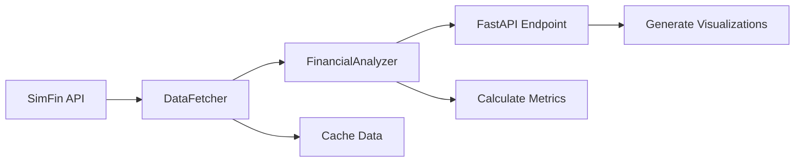

# Financial Analysis API: Comprehensive Stock Analysis with SimFin Data

## Table of Contents
- [Project Overview](#project-overview)
- [Demo](#demo)
- [Tools and Technologies](#tools-and-technologies)
- [Key Features](#key-features)
  - [Advanced API Architecture](#advanced-api-architecture)
  - [Efficient Data Management](#efficient-data-management)
  - [Financial Analysis Capabilities](#financial-analysis-capabilities)
  - [Interactive Visualization](#interactive-visualization)
- [Skills Demonstrated](#skills-demonstrated)
  - [Backend Development](#backend-development)
  - [API Integration](#api-integration)
  - [Object-Oriented Programming](#object-oriented-programming)
  - [Data Processing](#data-processing)
  - [Error Handling & Logging](#error-handling--logging)
- [Installation and Setup](#installation-and-setup)
- [Project Structure](#project-structure)
- [API Usage](#api-usage)
  - [Quick Start](#quick-start)
  - [Error Handling](#error-handling)
- [Troubleshooting](#troubleshooting)
- [Data Flow Architecture](#data-flow-architecture)
- [License](#license)


## Project Overview
A robust FastAPI-based financial analysis service that demonstrates advanced backend development capabilities through RESTful API design, external API integration, and complex data processing. The application fetches real-time financial data from SimFin's platform, processes it using object-oriented Python implementations, and delivers comprehensive financial analysis through both structured JSON endpoints and interactive visualizations.

## Demo
Below is a sample visualization of profit margins for AMZN generated by the API:


## Tools and Technologies
- **Backend Framework**: FastAPI for high-performance API development
- **Data Processing**: Pandas for financial calculations and data manipulation
- **External API Integration**: SimFin API with custom caching implementation
- **Statistical Analysis**: SciPy for volatility calculations
- **Visualization**: Plotly for interactive financial charts
- **Development Tools**: 
  * Uvicorn for ASGI server implementation
  * Python-dotenv for environment management
  * Logging for application monitoring
  * Pytest for automated testing
- **Development Environment**: Jupyter Notebook for analysis and testing

## Key Features
### **Advanced API Architecture**
   - RESTful endpoint design with FastAPI
   - Comprehensive error handling with custom exceptions
   - Request validation and type checking
   - Automatic API documentation with OpenAPI/Swagger

### **Efficient Data Management**
   - Custom caching system for SimFin data
   - Optimized data retrieval with pandas DataFrame
   - Structured data processing pipeline
   - Memory-efficient data handling

### **Financial Analysis Capabilities**
   - Real-time financial metrics calculation
   - Profit margin analysis (Gross, Operating, Net)
   - EPS and P/E ratio computations
   - CAGR calculations
   - Volatility analysis using SciPy

### **Interactive Visualization**
   - Dynamic chart generation with Plotly
   - Multiple visualization formats
   - Base64 encoded image responses
   - Custom chart configurations

## Skills Demonstrated

### **Backend Development**
   - FastAPI implementation with async support
   - RESTful API design principles
   - Middleware and dependency injection
   - Request/Response handling

### **API Integration**
   - External API consumption (SimFin)
   - Rate limiting and error handling
   - Data validation and transformation
   - Cache management

### **Object-Oriented Programming**
   - Modular class design (FinancialAnalyzer, DataFetcher)
   - Inheritance and encapsulation
   - Clean code principles
   - Design patterns implementation

### **Data Processing**
   - Complex financial calculations
   - Pandas DataFrame operations
   - Statistical analysis with SciPy
   - Data transformation pipelines

### **Error Handling & Logging**
   - Comprehensive exception handling
   - Custom error classes
   - Structured logging implementation
   - Debugging support

## Installation and Setup
```bash

# Ensure you have git and Python 3.8+ installed

# Clone the repository
git clone <repository-url>
cd <repository-directory>

# Create and activate virtual environment
python -m venv venv
source venv/bin/activate  # Linux/MacOS
venv\Scripts\activate     # Windows

# Install dependencies
pip install -r requirements.txt

# Configure environment variables
echo "SIMFIN_API_KEY=your_api_key_here" > .env
echo "DATA_DIR=data/simfin_data/" >> .env

# Run the API server
uvicorn src.main:app --reload

# (Optional) Open the Jupyter Notebook for analysis
jupyter notebook Analysis.ipynb
```

## Project Structure
```
.
├── Analysis.ipynb          # Jupyter notebook for testing and visualization
├── data/                  # Data cache directory
│   └── simfin_data/      # SimFin data storage
├── images/                  # Directory for images
│   └── AMZN Profit Margin annual.png # Example chart image
├── LICENSE                 # Project license
├── requirements.txt       # Project dependencies
├── src/                  # Source code directory
│   ├── __init__.py      # Package initialization
│   ├── data_analysis.py # Financial calculations and analysis
│   ├── data_fetcher.py  # SimFin API integration and caching
│   └── main.py         # FastAPI application and endpoints
└── tests/               # Test directory
    ├── test_main.http  # HTTP request tests
    ├── test_main.py   # API endpoint tests
    └── test_simfin.py # SimFin integration tests
```

## API Usage

The API provides interactive documentation at `http://localhost:8000/docs` (available after starting the server).

### Quick Start
```python
# Start the API server
uvicorn src.main:app --reload

# Access the API endpoints
import requests

# Get financial analysis for Amazon
response = requests.get('http://localhost:8000/analysis/AMZN')
data = response.json()

# Access specific metrics
financial_data = response.json()['data']
margins = {
    'gross_margin': financial_data['Gross_Margin'],
    'operating_margin': financial_data['Operating_Margin'],
    'net_margin': financial_data['Net_Margin']
}
```

### Error Handling
The API implements comprehensive error handling:
```python
try:
    response = requests.get('http://localhost:8000/analysis/INVALID')
except requests.exceptions.RequestException as e:
    print(f"API Error: {e}")
```

## Testing
The project includes automated tests using Pytest to ensure reliability:
- `test_main.py`: Tests for API endpoints
- `test_simfin.py`: Tests for SimFin API integration
- `test_main.http`: HTTP request tests

To run the tests:
```bash
pytest tests/

## Troubleshooting
1. SimFin API Connection Issues
   ```bash
   # Verify API key
   echo $SIMFIN_API_KEY
   
   # Clear cache if needed
   rm -rf data/simfin_data/*
   ```

2. Performance Optimization
   - Enable data caching
   - Use quarterly variant for faster initial loads
   - Monitor memory usage with large datasets

## Troubleshooting
### **SimFin API Connection Issues**

```bash
   # Verify API key
   echo $SIMFIN_API_KEY
   
   # Clear cache if needed
   rm -rf data/simfin_data/*
```
    
### Uvicorn Server Not Starting
- **Ensure port 8000 is free**: Check if another process is using the port and terminate it if necessary.
- **Dependencies**: Verify all dependencies are installed using `pip install -r requirements.txt`.
- **Python Version**: Ensure Python 3.8+ is installed.

### Jupyter Notebook Not Opening
- **Installation**: Confirm Jupyter is installed with `pip install jupyter`.
- **Directory**: Run the notebook from the correct directory using `cd <project-directory>`.
- **Error Logs**: Check the terminal for any errors.

### Performance Optimization
- **Data Caching**: Enable caching to reduce redundant API calls.
- **Quarterly Variant**: Use quarterly data for faster initial loads.
- **Memory Usage**: Monitor memory usage when working with large datasets.

## Data Flow Architecture


Data flows from the SimFin API through the DataFetcher (which handles caching), to the FinancialAnalyzer (which computes metrics like P/E ratio and CAGR), and finally to the FastAPI endpoint (which returns JSON data and visualizations).
    
## License
This project is licensed under the MIT License - see the [LICENSE](LICENSE) file for details.

For more detailed information, please refer to the source code documentation and tests.